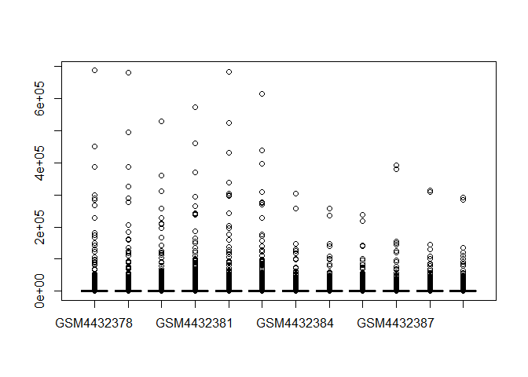
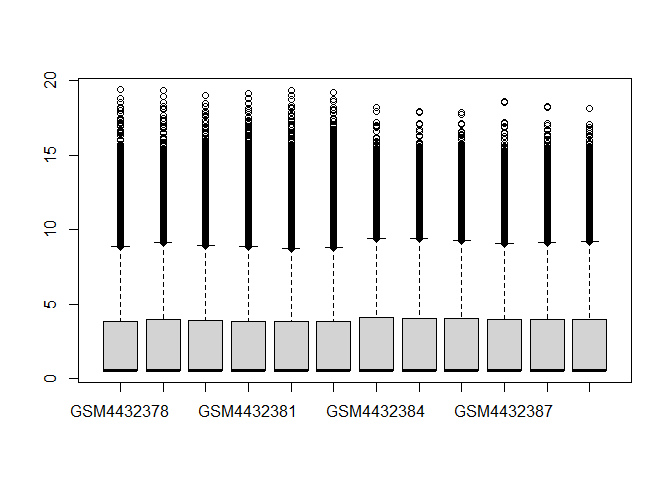

RNAseq workflow and notes
================
John Jacob
26/09/2021

## R Markdown

This is an R Markdown document. Markdown is a simple formatting syntax
for authoring HTML, PDF, and MS Word documents. For more details on
using R Markdown see <http://rmarkdown.rstudio.com>.

When you click the **Knit** button a document will be generated that
includes both content as well as the output of any embedded R code
chunks within the document. You can embed an R code chunk like this:

message = FALSE stops R loading package messages

``` r
library(tidyverse)
library(ggplot2)
library(tximport)
library(DESeq2)
```

create a tibble of the metadata table, SraRunTable.txt

``` r
sample_table <- read_csv('SraRunTable.txt')
```

    ## Rows: 48 Columns: 34

    ## -- Column specification --------------------------------------------------------
    ## Delimiter: ","
    ## chr  (25): Run, Assay Type, BioProject, BioSample, Center Name, Consent, DAT...
    ## dbl   (3): AvgSpotLen, Bases, Bytes
    ## lgl   (5): tissue/cell_type, time_after_treatment, sub_species, tissue, subj...
    ## dttm  (1): ReleaseDate

    ## 
    ## i Use `spec()` to retrieve the full column specification for this data.
    ## i Specify the column types or set `show_col_types = FALSE` to quiet this message.

Select appropriate columns in SraRunTable.txt. Where the column names
have spaces encase the column name in backticks. ‘distinct()’ selects
only 12 unique sample accessions

``` r
sample_table <- select(sample_table,`Sample Name`, source_name, treatment, 
                       cell_line, cell_type, time_point) 
sample_table <- distinct(sample_table)
```

‘pull’ the 1st column with unique sample names. Label each sample using
‘names’ which is like the index number to list all the elements of a
vector

``` r
sample_files <- paste0(pull(sample_table, `Sample Name`), '/quant.sf')
names(sample_files) <- pull(sample_table, `Sample Name`)
```

tximport: file paths given by ‘GSM…./quant.sf’ tell tximport WHERE to
find the inputdata. ‘names’ function is used to tell tximport WHAT the
column headers should be for the output data produced by tximport.
Otherwise columns would just have number headers, which would make it
harder to identify samples. create the tx2gene file, ‘gene\_map’ that is
one of the inputs for tximport. This file was created using the terminal
emulator (VM Xubuntu). ‘gene\_map’ columns must be in correct order:
transcript ID, gene ID. ’ignoreTxVersion set to TRUE because don’t want
version number of transcript, ie number after dot in Ensembl transcript
ID.

``` r
gene_map <- read_csv('gene_map.csv', col_names = c('enstID', 'ensgID'))
```

    ## Rows: 237012 Columns: 2

    ## -- Column specification --------------------------------------------------------
    ## Delimiter: ","
    ## chr (2): enstID, ensgID

    ## 
    ## i Use `spec()` to retrieve the full column specification for this data.
    ## i Specify the column types or set `show_col_types = FALSE` to quiet this message.

``` r
count_data <- tximport(files = sample_files, 
         type = 'salmon',
         tx2gene = gene_map,
         ignoreTxVersion = TRUE)
```

    ## reading in files with read_tsv

    ## 1 2 3 4 5 6 7 8 9 10 11 12 
    ## removing duplicated transcript rows from tx2gene
    ## summarizing abundance
    ## summarizing counts
    ## summarizing length

the below ‘count..’ function is just to test if everything up to this
point is working ok (see also covid\_RNA\_analysis.R file).

``` r
count_data$counts[1:6, ]
```

    ##                 GSM4432378 GSM4432379 GSM4432380 GSM4432381 GSM4432382
    ## ENSG00000000003    216.000    253.924    361.000    204.999    158.000
    ## ENSG00000000005      0.000      0.000      0.000      0.000      0.000
    ## ENSG00000000419    748.832    751.589   1526.705    712.355    722.817
    ## ENSG00000000457    169.077    160.017    237.552    133.188    150.008
    ## ENSG00000000460     70.270     65.753     94.999     57.997     58.896
    ## ENSG00000000938      4.000      1.000      1.000      2.000      1.000
    ##                 GSM4432383 GSM4432384 GSM4432385 GSM4432386 GSM4432387
    ## ENSG00000000003    551.899   1113.999    613.286    388.005   1813.961
    ## ENSG00000000005      0.000      0.000      0.000      0.000      0.000
    ## ENSG00000000419   1797.263    934.367    576.057    368.948   1610.338
    ## ENSG00000000457    349.000    207.654    122.430     93.272    320.788
    ## ENSG00000000460    197.507    586.156    294.761    241.823    836.729
    ## ENSG00000000938      4.000      0.000      0.000      0.000      0.000
    ##                 GSM4432388 GSM4432389
    ## ENSG00000000003   1168.757    906.018
    ## ENSG00000000005      0.000      0.000
    ## ENSG00000000419   1160.964    866.337
    ## ENSG00000000457    243.911    140.290
    ## ENSG00000000460    582.447    421.063
    ## ENSG00000000938      2.000      0.000

DESeq2: needs a df not a tibble for colData argument. colData is derived
from sample\_table above. Process sample\_table so there are no spaces.
‘colnames()’ argument changes ‘Sample Name’ to ‘Sample’

``` r
sample_table <- as.data.frame(sample_table)
colnames(sample_table)[1]
```

    ## [1] "Sample Name"

add a new column, ‘conditions’ that relabels the 4 existing conditions
to reflect cell-line dependence (there could be other variables that we
could look at that are cell-line independent)

``` r
conditions <- c('mock_nhbe', 'infected_nhbe', 
                'mock_a549', 'infected_a549')
```

there are only 4 conditions but 12 samples, so repeat each condition 3
times:

``` r
conditions <- rep(conditions, each = 3)
```

turn ‘conditions’ into a factor:

``` r
conditions <- factor(conditions)
```

add ‘conditions’ to sample\_table:

``` r
sample_table$conditions <- conditions
```

use new DESeq2 command. \~ sign means ‘given’ so we’re saying we want to
find expression of gene ENSG… GIVEN our experiment. ‘design’ argument is
assumed to be the gene expression matrix.

``` r
deseq_dataset <- DESeqDataSetFromTximport(txi = count_data,
                                          colData = sample_table,
                                          design = ~conditions)
```

    ## using counts and average transcript lengths from tximport

use extractor functions of DESeq2 (‘counts’) to get specific counts
info. Use next two lines of code to compare ‘counts’ (DESeq) to
‘count\_data ()’ (tximport). These lines of code simply allow us to
explore the data. The data in counts(deseq..) has been rounded. From the
output data of the below code we can’t tell if the differences between
gene counts represent REAL changes in gene expression

``` r
counts(deseq_dataset)[1:6, 1:3]
```

    ##                 GSM4432378 GSM4432379 GSM4432380
    ## ENSG00000000003        216        254        361
    ## ENSG00000000005          0          0          0
    ## ENSG00000000419        749        752       1527
    ## ENSG00000000457        169        160        238
    ## ENSG00000000460         70         66         95
    ## ENSG00000000938          4          1          1

``` r
count_data$counts[1:6, 1:3]
```

    ##                 GSM4432378 GSM4432379 GSM4432380
    ## ENSG00000000003    216.000    253.924    361.000
    ## ENSG00000000005      0.000      0.000      0.000
    ## ENSG00000000419    748.832    751.589   1526.705
    ## ENSG00000000457    169.077    160.017    237.552
    ## ENSG00000000460     70.270     65.753     94.999
    ## ENSG00000000938      4.000      1.000      1.000

Normalize data first. In an RNA-seq library reads map to a gene in
proportion to 3 things: 1. gene length - don’t need to correct for this
as RNA-seq compares the same gene under different conditions. Only
matters when comparing geneA to geneB. BUT gene length info is in
tximport so DESeq2 uses this to calculate a per gene normalisation also
2. gene expression 3. library depth - normalisation required to remove
this effect. DESeq2 applies TMM - trimmed median of means

DESeq2 - 1. estimates SIZE FACTORS (normalization step) 2. estimates
DISPERSIONS of count data which is a key factor in the negative binomial
distribution, which is used to measure differential gene expression in
DESeq2 - this is sum of the variance due to biological/stochastic gene
expression (noise) AND the systematic experimental (technical)
variation. For low-expressed genes the technical variance dominates, and
for high-expressed genes the biological noise predominates

DESeq2: a) finds geometric mean of each row b) calculates ratio of raw
count for a gene to its row geometric mean c) remember the geometric
mean of a row that contains a zero is zero d) those rows that have a
zero geometric mean are ignored (NaN or Inf). e) finds the median of
each column f) the latter value is then the ‘size factor’ for the
library g) to generate normalised counts Deseq divides raw counts by the
size factor for that column. DESeq2 - 3 steps to analysis: 1.estimate
size factors (normalisation) 2.estimate dispersions - dispersion arises
from 2 sources - biological/stochastic variation in gene expression AND
technical variation - low-expressed genes have high technical variation
and high-expressed genes have high stochastic expression. DESeq2 does
not rely on large number of sample replicates (typically \~3), but uses
the expression of the entire gene set to estimate dispersion, because
the different gene expressions are not independent of each other. 3.
apply statistics (Wald test). test is applied across RNA-seq data which
is a negative binomial distribution

Deseq2 finds size factors for library and modifies it by the gene
length. Both commands below process the data to this end and are
equivalent. ‘normalizationFactors’ is a matrix of the same dimensions as
our gene expression matrix. Every gene in every sample has its own
normalisation factor.DON’T need to call this ‘normalizationFactors’
function in workflow

use extraction function again in DESeq2 - ‘counts’ just to view some of
the data no need to run below command for normalisation to work; the
above command does it. The ‘counts’ function must be used to access
counts data in deseq\_dataset - simply typing ‘deseq\_dataset’ won’t
work, and will instead print a summary only. Note that prior
‘normalizationFactors’ function does not need to be run before the
‘counts’ function below - call below function just to quickly check the
data.

``` r
counts(deseq_dataset, normalized = TRUE)[1:6, 1:3]
```

    ##                 GSM4432378  GSM4432379  GSM4432380
    ## ENSG00000000003 220.069897  347.221948  317.962721
    ## ENSG00000000005   0.000000    0.000000    0.000000
    ## ENSG00000000419 976.852459 1043.940463 1290.310517
    ## ENSG00000000457 229.810719  191.130072  187.231708
    ## ENSG00000000460 106.143181  101.556555  104.601244
    ## ENSG00000000938   3.578526    0.940805    1.426483

To visualise count data this boxplot shows the very large range of
counts, with the first six samples having larger values/ranges

``` r
boxplot(counts(deseq_dataset, normalized = TRUE))
```

<!-- -->

PCA: assumes normal count distribution, but count values are not
normally distributed. The LOG transformed counts are roughly normally
distributed. However, zero normalised count values create problems. Also
low count values have high variance and high count values have low
variance, so ‘regularised log transformation’ in DESeq2 takes account of
the changing variance across an RNAseq dataset. 2nd transfomation (VST -
variance stabilisation transform) is a variance stabilising
transformation. The main difference between these two transformations is
speed. VST is faster.

``` r
vst <- varianceStabilizingTransformation(deseq_dataset)
```

use another accessor function, ‘assay’ to graph vst output, which
produces output with a smaller y-axis range, but that is because it is a
log scale. ‘assay’ used to access count data within vst - typing ‘vst’
alone will not access data.

``` r
boxplot(assay(vst))
```

<!-- -->
